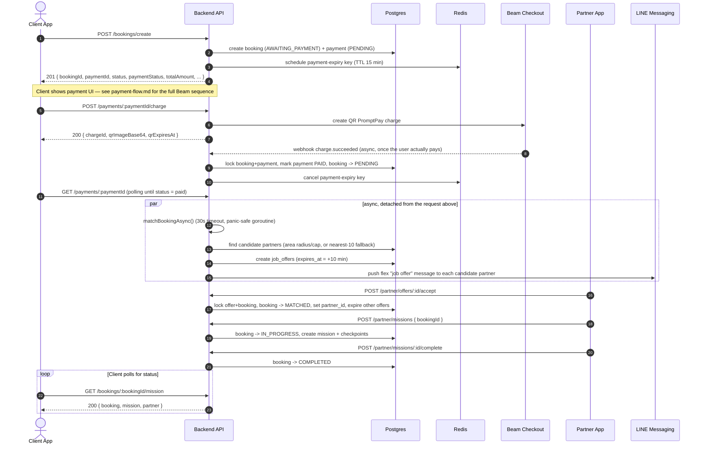
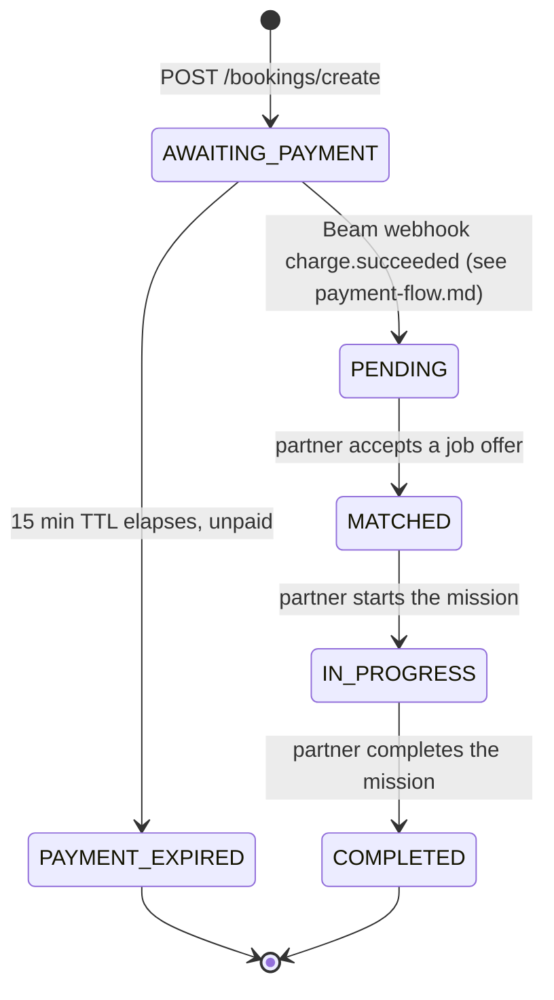

# Booking & Matching Flow — Frontend Reference

Audience: client/web app frontend team integrating against `/api/v1/*`.
Base path for everything below: `/api/v1` (e.g. `POST /api/v1/bookings/create`).
Auth: unless noted "public", every endpoint requires the `caremate_session` cookie / bearer token issued by `/api/v1/authentication/login` (see `authRequired` middleware).

> Scope note: booking, payment and matching-status endpoints below are the ones your app calls directly. The **matching/offer/mission** steps in the middle of the diagram are performed by the backend and the **partner app** (`/api/v1/partner/...`) — you don't call them, but understanding them explains why a booking's status changes asynchronously after payment.

> **Payment section below is stale — see `payment-flow.md`.** `POST /payments/confirm` (§3.4 below) has been replaced by real Beam Checkout QR PromptPay charges (`POST /payments/:paymentID/charge`), confirmed server-side only via Beam's webhook. `payment-flow.md` (same repo root) is now the source of truth for the payment step; the rest of this document (booking creation, matching, mission polling) is unaffected and still accurate.

---

## 1. End-to-end sequence



**Key implication for the frontend:** there is no push/webhook to the client app (Beam's webhook lands on the backend only). Once the client's own poll of `GET /payments/:paymentId` observes `status: "paid"`, matching has already been kicked off in the background by the backend. The client must then **poll** `GET /bookings/:bookingId/mission` (or `GET /bookings`) to observe `booking.status` moving from `PENDING` → `MATCHED` → `IN_PROGRESS` → `COMPLETED`, and to pick up `partner` details once matched.

---

## 2. Booking status lifecycle



Notes:
- `CANCELLED` exists as a DB enum value but **no cancel-booking endpoint is currently implemented** for the client app — don't build a "cancel" button against this API yet.
- **Known gap (backend, not yet fixed):** if no partner accepts within the 10-minute offer window, nothing currently retries or notifies — the booking can get silently stuck at `PENDING`. If you're polling and see a booking stay `PENDING` for a long time, that's this gap, not a bug in your polling logic. Worth surfacing a "still looking for a partner, this is taking longer than usual" state in the UI after ~10–15 min.

Payment status (`payment.status`, separate field) — `pending` → `paid` (on Beam webhook `charge.succeeded`, see `payment-flow.md`) / `expired` (on TTL) / `refunded`. `CreateBookingResponse.paymentStatus` and `booking.status` are independent fields; don't conflate them.

---

## 3. Endpoint reference

### 3.1 `GET /care/services` — public

List active service types (e.g. "transport", home-care variants) to populate the booking form.

Response `200`:
```json
{
  "status": 200,
  "message": "success",
  "data": [
    {
      "id": "uuid",
      "slug": "transport",
      "name_th": "...",
      "name_en": "...",
      "base_fee": 300.0,
      "icon_name": "car",
      "offer_ttl_minutes": 15,
      "is_active": true,
      "seq": 1
    }
  ]
}
```

### 3.2 `GET /payments/methods` — public

List active payment methods to populate the payment step.

Response `200`:
```json
{
  "message": "payment methods retrieved successfully",
  "data": [
    { "id": "uuid", "slug": "cash", "name_th": "...", "name_en": "...", "provider": null, "icon_name": "cash", "is_active": true }
  ]
}
```

### 3.3 `POST /bookings/create` — auth required

Creates the booking + its payment row in one transaction. Booking starts `AWAITING_PAYMENT`, payment starts `PENDING`. A 15-minute payment-expiry timer starts immediately.

Request body:
```json
{
  "serviceTypeId": "uuid",
  "paymentMethodId": "uuid",
  "isForSelf": true,
  "relativeId": null,
  "scheduledStartAt": "2026-08-03T09:00:00+07:00",
  "scheduledEndAt": "2026-08-03T11:00:00+07:00",
  "pickupAddress": "123 Main St",
  "pickupLat": 13.7563,
  "pickupLng": 100.5018,
  "destinationAddress": null,
  "destinationLat": null,
  "destinationLng": null,
  "contactName": "Jane Doe",
  "contactPhone": "0891234567",
  "specialNotes": null
}
```

Field rules:
- `serviceTypeId`, `paymentMethodId`, `scheduledStartAt`, `scheduledEndAt`, `pickupAddress`, `contactName`, `contactPhone` are required.
- `scheduledStartAt` / `scheduledEndAt` must be RFC3339 timestamps; `scheduledEndAt` must be after `scheduledStartAt`.
- If `isForSelf` is `false`, `relativeId` is **required** (must reference an existing relative under the caller's account).
- If the selected service type's slug is `transport`, `destinationAddress`, `destinationLat`, `destinationLng` are all **required**; distance/fee is computed from pickup→destination. For non-transport services these can be omitted.
- Duration is rounded up to the nearest 30-minute step; fee = `base_fee` scaled by rounded duration, `platformFee` = 20% of fee, `partnerPayout` = fee − platformFee.

Response `201`:
```json
{
  "status": 201,
  "message": "booking created",
  "data": {
    "bookingId": "uuid",
    "paymentId": "uuid",
    "reference": "BK20260803XXXX",
    "status": "AWAITING_PAYMENT",
    "paymentStatus": "PENDING",
    "totalAmount": 300.0,
    "platformFee": 60.0,
    "partnerPayout": 240.0,
    "distanceKm": 0,
    "durationMinutes": 120
  }
}
```

Error responses:
| Condition | Status | code |
|---|---|---|
| Missing/invalid fields, bad schedule range, missing transport destination | `400` | `INVALID_BOOKING_REQUEST` |
| User already has a booking in progress | `409` | `BOOKING_IN_PROGRESS` |
| Unexpected error | `500` | `INTERNAL_SERVER_ERROR` |

### 3.4 ~~`POST /payments/confirm`~~ — **removed**

This endpoint let the client self-report a payment as paid, with nothing checked server-side — it's gone. Payment now goes through real Beam Checkout QR PromptPay charges, confirmed only by Beam's webhook. See **`payment-flow.md`** for the replacement endpoint (`POST /payments/:paymentID/charge`) and the full sequence.

### 3.5 `GET /bookings/:bookingID/mission` — auth required

The primary polling endpoint once payment is confirmed. Returns booking + mission (if started) + matched partner (if any).

Response `200`:
```json
{
  "status": 200,
  "message": "booking mission detail retrieved successfully",
  "data": {
    "booking": { "id": "...", "status": "MATCHED", "partner_id": "...", "...": "..." },
    "mission": {
      "id": "...", "booking_id": "...", "partner_id": "...",
      "status": "active", "started_at": "...", "completed_at": null,
      "checkpoints": [
        { "id": "...", "step": 1, "label_th": "...", "label_en": "...", "completed_at": null, "lat": null, "lng": null, "notes": "" }
      ]
    },
    "partner": { "id": "...", "name": "...", "phone": "...", "rating_avg": 4.8, "current_lat": 13.75, "current_lng": 100.5, "...": "..." }
  }
}
```
`mission` and `partner` are `null` until the booking reaches `MATCHED` / `IN_PROGRESS`. Poll this on an interval (e.g. every 5–10s) while `booking.status` is `PENDING`, and slow down or use it on-demand once `IN_PROGRESS`.

Errors: `404` if the booking doesn't exist (or doesn't belong to the caller), `400` `invalid booking id` if the path param isn't a UUID.

### 3.6 `GET /bookings/` — auth required

All of the caller's bookings (any status), for a "my bookings" / active-bookings list.

Response `200`:
```json
{ "status": 200, "message": "bookings retrieved successfully", "data": { "total": 3, "bookings": [ /* domain.Booking[] */ ] } }
```

### 3.7 `GET /bookings/history` — auth required

Same shape as 3.6, scoped to historical (presumably completed/cancelled) bookings — use for a booking-history screen.

```json
{ "status": 200, "message": "booking history fetched", "data": { "total": 3, "bookings": [ /* domain.Booking[] */ ] } }
```

### 3.8 `GET /payments/:paymentID` — auth required

Fetch a single payment by ID (e.g. to re-render the payment step or verify status independently of the booking).

Response `200`:
```json
{ "status": 200, "message": "payment fetched", "data": { "payment": { "id": "...", "booking_id": "...", "status": "paid", "total_amount": 300.0, "platform_fee": 60.0, "partner_payout": 240.0, "paid_at": "...", "...": "..." } } }
```
Errors: `400` `INVALID_PAYMENT_REQUEST` (bad/missing paymentID), `404` `PAYMENT_NOT_FOUND`.

---

## 4. Partner-side steps (context only, not called by this client)

These run on the partner app (`/api/v1/partner/...`) and are what actually advances your polled `booking.status`:

| Step | Endpoint | Effect |
|---|---|---|
| Partner sees offer | (LINE push message + `GET /partner/offers`) | `job_offers` row created, 10 min TTL |
| Partner accepts | `POST /partner/offers/:id/accept` | booking → `MATCHED`, `partner_id` set, other offers expired |
| Partner declines | `POST /partner/offers/:id/decline` | offer marked declined; booking stays `PENDING` awaiting another partner |
| Partner starts job | `POST /partner/missions` | booking → `IN_PROGRESS`, mission + checkpoints created |
| Partner completes checkpoint | `PATCH /partner/missions/:id/checkpoints/:step` | checkpoint marked done |
| Partner completes job | `POST /partner/missions/:id/complete` | booking → `COMPLETED` |

---

## 5. Suggested client polling strategy

1. Once polling `GET /payments/:paymentId` (see `payment-flow.md`) observes `status: "paid"`, start polling `GET /bookings/:bookingId/mission` every ~5s.
2. While `booking.status === "PENDING"`: show "finding a partner near you". If this exceeds ~10 min, show a soft warning (see gap noted in §2) and consider offering support contact / retry, since nothing currently auto-retries matching on the backend.
3. On `MATCHED`: show partner info from the `partner` object, slow polling interval (e.g. 15–30s) or switch to on-demand refresh.
4. On `IN_PROGRESS`: use `mission.checkpoints` to render progress.
5. On `COMPLETED`: stop polling, move to a completed/rating screen.
6. If `booking.status === "PAYMENT_EXPIRED"` is ever observed (shouldn't happen if you called confirm in time), treat the booking as dead — no retry path exists, user must create a new booking.
