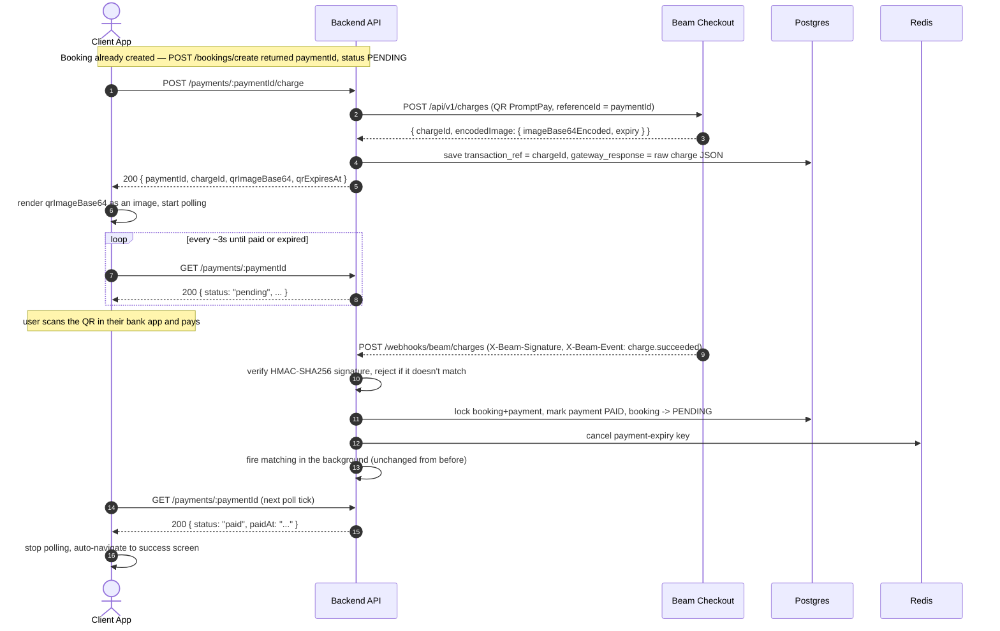

# Payment Flow — Beam Checkout Integration

Audience: frontend team integrating the payment step, and anyone picking this
up later who needs to understand how it actually works end to end. Base path
for everything below: `/api/v1`. This document replaces `booking-flow.md`
§3.4 (`POST /payments/confirm`), which no longer exists.

## Why this changed

The old flow let the client itself call `POST /payments/confirm` to mark a
booking's payment as `paid` — nothing was ever actually checked server-side.
Any authenticated user could get a free booking by calling that one endpoint
directly. This rewrite replaces it with real payments through
[Beam Checkout](https://docs.beamcheckout.com), a Thailand payments gateway,
confirmed **only** by Beam's own webhook (plus a reconciliation fallback —
see below). The client can no longer assert that a payment succeeded; it can
only ask Beam to create a charge and then watch the payment's status change.

Scope of this pass: **QR PromptPay only**. No credit card / 3DS yet — that
would need an in-app webview and card tokenization, deliberately deferred.

## End-to-end sequence



**The client never confirms payment.** It creates the charge, shows the QR,
and polls for the status to flip. Nothing it sends can mark a payment paid.

## Endpoint reference

### `POST /payments/:paymentID/charge` — auth required

Creates a Beam QR PromptPay charge for a payment the caller owns, or returns
the already-created one if called again before it expires (safe to retry —
double-tapping the "show QR" button, or reloading the payment page, does not
create a second charge).

Response `200`:
```json
{
  "status": 200,
  "message": "charge created",
  "data": {
    "paymentId": "uuid",
    "chargeId": "ch_...",
    "qrImageBase64": "iVBORw0KGgoAAAANSU...",
    "qrExpiresAt": "2026-08-29T12:34:56+07:00"
  }
}
```

`qrImageBase64` is a ready-to-render image (PNG) straight from Beam — decode
and display it directly (e.g. Flutter's `Image.memory(base64Decode(...))`).
It is **not** an EMV payload string — nothing needs to generate a QR from it
client-side anymore.

Errors:
| Condition | Status | code |
|---|---|---|
| Missing/invalid paymentID | `400` | `INVALID_PAYMENT_REQUEST` |
| Payment isn't `PENDING`, or its 15-minute window already passed | `409` | `PAYMENT_NOT_PENDING` |
| Payment doesn't exist / doesn't belong to the caller | `404` | `PAYMENT_NOT_FOUND` |
| Beam API call failed | `500` | `INTERNAL_SERVER_ERROR` |

### `GET /payments/:paymentID` — auth required (unchanged endpoint, now the primary way to learn payment succeeded)

Poll this after calling the charge endpoint. Same shape as before:
```json
{ "status": 200, "message": "payment fetched", "data": { "payment": { "id": "...", "status": "pending", "total_amount": 300.0, "paid_at": null, "expired_at": "...", "...": "..." } } }
```

`status` moves `pending` → `paid` once Beam's webhook lands, or → `expired`
if the 15-minute TTL elapses unpaid (same expiry mechanism as before — the
Beam charge's own expiry is set to match this exactly). Recommended polling
interval: ~3 seconds while `pending`; stop on `paid` or `expired`.

## Admin refund (backend-only, no UI yet)

`POST /admin/payments/:paymentID/refund` — `super_admin`/`operator` role
required (AdminJWT + role check, not the client app's auth). Body:
```json
{ "reason": "customer requested cancellation", "amount": 0 }
```
`amount` is baht; `0` or omitted refunds the full amount (required for
non-card methods like QR PromptPay — partial refunds only work for `CARD`
charges per Beam's rules). This only **starts** the refund at Beam — the
payment stays `PAID` until the `refund.succeeded` webhook (see below)
confirms it and flips `payment.status` to `REFUNDED`. Safe to call twice for
the same payment: it returns the already-initiated refund instead of firing
a second one at Beam.

This closes the loop on `CancelBookingByUser`'s existing `refundRequired:
true` flag (returned when a customer cancels a booking that was already
paid) — until now that flag had nothing automated behind it. **There is
still no admin UI action wired to call this** — it's backend-complete,
front-end-pending, by design for this pass.

## What happens on the backend (for context, not something the client calls)

- **Webhooks** — two URLs, given to Beam Lighthouse purely so it's
  unambiguous which is which; both run identical logic, since Beam
  identifies the event by the `X-Beam-Event` header, not by which URL
  received it:
  - `POST /webhooks/beam/charges` — `charge.succeeded` / `charge.failed`
  - `POST /webhooks/beam/refunds` — `refund.succeeded` / `refund.failed`

  Both are public (Beam can't send a session cookie or JWT). Authenticity is
  verified via the `X-Beam-Signature` header (HMAC-SHA256 over the raw
  request body, using a secret from Beam Lighthouse) — a request that fails
  this check is rejected outright and never touches the database.
  On `charge.succeeded`, the backend looks up the payment by the charge's
  `chargeId` (stored as `transaction_ref`) and runs the same paid-transition
  logic the old `/payments/confirm` used (lock booking+payment, mark paid,
  cancel the Redis expiry key, notify the user, kick off partner matching in
  the background). On `refund.succeeded`, it resolves the payment the same
  way (a refund object always carries the `chargeId` of the charge it
  refunds) and marks the payment `REFUNDED`, storing the refund's own id in
  `transaction_ref`'s sibling column `refund_ref`. Everything here is
  idempotent — Beam retries an undelivered-2xx webhook up to 10 times with
  backoff, and a replay of an already-processed event is treated as a no-op
  success rather than an error.

  Note: there is still no way to *initiate* a refund from this app (no admin
  action calls Beam's Refunds API yet) — this only makes the backend record
  a refund correctly if/when one happens by some other means (e.g. directly
  in Beam's dashboard).
- **Reconciliation sweep** (every 30s): in case a charge webhook is ever
  lost — delivery failure, a misconfigured secret, the server being down
  during a redeploy — the backend independently asks Beam about any payment
  that's been sitting `PENDING` with a charge for more than 30 seconds. If
  Beam says it actually succeeded, the payment gets confirmed exactly the
  same way the webhook would have done it. This means a real payment can
  never be silently lost even if the webhook never arrives — worth knowing
  if a tester ever pays and the app *seems* stuck: it should self-correct
  within moments, not stay stuck forever. (This sweep only covers charges,
  not refunds — there's no refund-initiation flow yet to reconcile against.)
- A failed charge (`charge.failed`) does not change `payment.status` — it
  just clears the stored charge reference so the next call to
  `POST /payments/:paymentID/charge` issues a fresh QR instead of returning
  a dead one, within the same 15-minute window.

## Flutter client changes that go with this

- `promptpay_qr.dart` (the old client-side EMV QR generator) is gone —
  there's nothing left calling it. The QR shown to the user is now the exact
  image Beam returns from the charge endpoint.
- The old "ฉันชำระเงินแล้ว" ("I've paid") button is gone — there is nothing
  left for the user to tap to confirm payment. The payment page instead
  polls `GET /payments/:paymentId` and auto-navigates to the success screen
  the moment `status` flips to `paid`, with no user action required.
